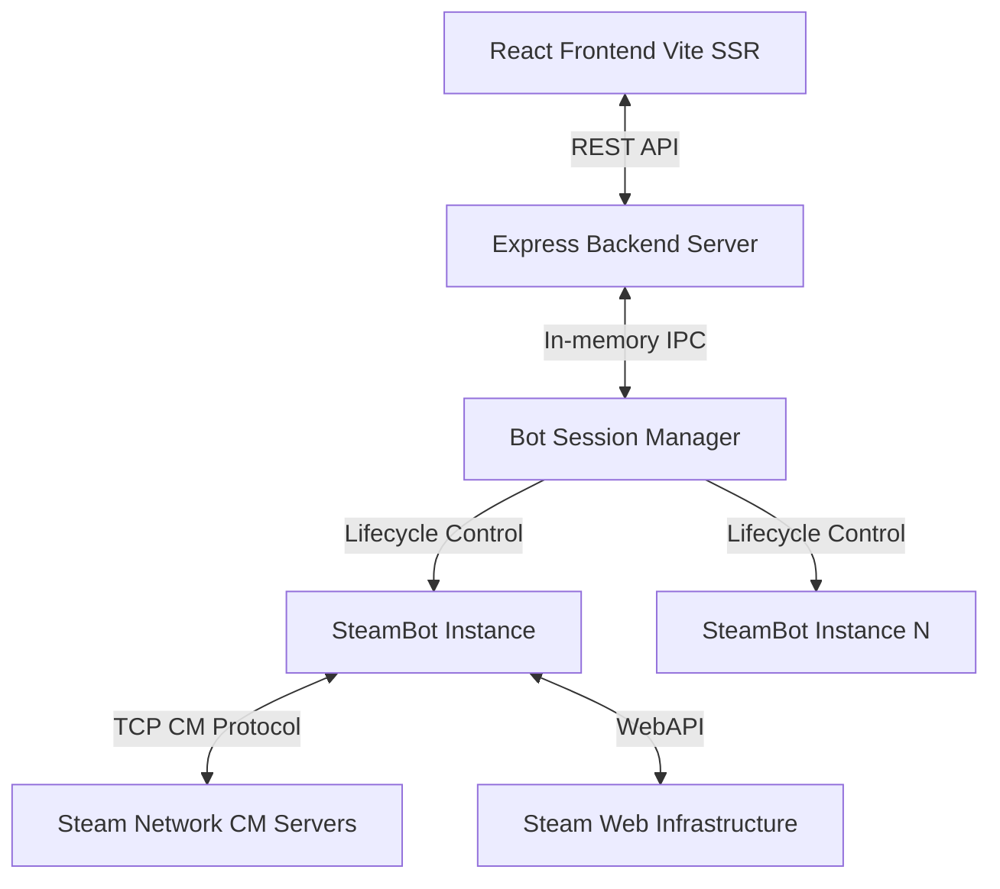
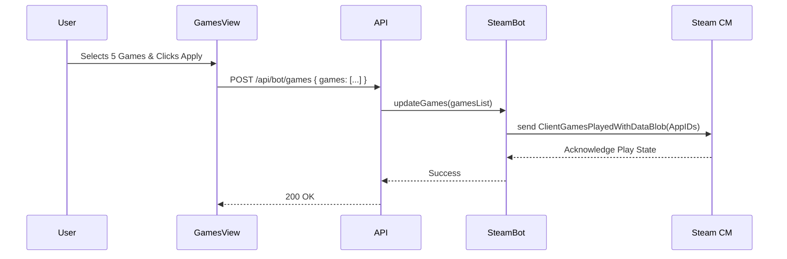

# System Architecture & Engineering Documentation

## 1. Overview
The platform is an enterprise-grade Steam automation system architected to manage authenticated interactions, parallel game state simulation (idling), account persona synchronization, and device lifecycle management. It utilizes a React-based frontend interacting with a Node.js Express backend communicating natively with the Steam Connection Manager (CM) via the custom lightweight TCP protocol.

## 2. High-Level Architecture



### 2.1 Backend Design Principles
*   **Decoupled Session State**: The Node.js application relies on stateless Express API routes that interface with a stateful singleton `BotManager`.
*   **Native Protocol Implementation**: Instead of headless browsers for the heavy lifting, the system leverages `steam-user` to talk directly over TCP to Steam's internal CMs (Connection Managers).
*   **Memory Efficiency**: Active game idling utilizes `ClientGamesPlayedWithDataBlob` proto-messages to broadcast simulated game state rather than spinning up heavy runtime processes for each application.

## 3. Directory Structure & Component Details

```
/src
├── /components         # React Functional Components (Presentation & Logic)
├── /data               # Static data stores
├── /lib                # Shared utility modules
├── /server             # Backend application logic and Steam Networking
├── App.tsx             # Root Application Layout & State Provider
├── main.tsx            # React DOM Entry Point
├── types.ts            # Enterprise TypeScript Type Definitions
└── index.css           # Global Styling Variables
```

### 3.1 Backend Components (`/src/server`)

#### `server.ts`
*   **Role**: Application bootstrap and middleware configuration.
*   **Design**: Initializes Vite in middleware mode for local SSR during development, mounts the API router, and binds to the configured network port. Handles graceful shutdown sequences.

#### `BotManager.ts`
*   **Role**: Singleton instance manager for Bot lifecycle.
*   **Design**: Provides an in-memory dictionary tracking initialized bot sessions by username. Prevents race conditions during connection transitions.

#### `SteamBot.ts`
*   **Role**: Core connectivity implementation.
*   **Design**: 
    *   Implements secure Authentication mechanisms (Credentials, Login Token, QR).
    *   Manages Persona State (Online, Offline, Invisible).
    *   Controls parallel Idling via EMsg payload manipulation.
    *   Maintains the active TCP socket loop and keep-alive packets.

#### `AllPlayedSteamGamesRetriever.ts`
*   **Role**: Multi-layered data aggregation service.
*   **Design**: Uses a fallback waterfall architecture (SSR Scraping -> WebAPI -> Native Client -> In-Memory Cache) to guarantee the retrieval of all owned/played titles despite varying profile privacy settings.

#### `routes.ts`
*   **Role**: Express router definition.
*   **Design**: Strictly defines the HTTP interface between the frontend and the `BotManager`. Validates payloads and standardizes JSON error responses.

### 3.2 Frontend Components (`/src/components`)

#### `App.tsx` & `main.tsx`
*   **Role**: Global state container and DOM binding.
*   **Design**: Employs React Context or prop-drilling to maintain the global bot status (Connected, Logged Off, Awaiting 2FA) and provides the routing shell.

#### `DashboardView.tsx`
*   **Role**: Central telemetry and status monitoring.
*   **Design**: Parses the active event stream, aggregates logs, and displays the real-time health metrics of the running Steam instance.

#### `AccountView.tsx`
*   **Role**: Session initiation and Identity management.
*   **Design**: Handles the complex multi-step login flows (QR polling, 2FA prompt handling, Refresh token storage). Allows modifying Persona State (e.g., Invisible).

#### `GamesView.tsx`
*   **Role**: Parallel Idling Configuration interface.
*   **Design**: Manages a grid/list of interactive game cards. Implements the dispatch logic to clear all games (empty array) or apply up to 32 concurrent AppIDs to the SteamBot's idle state.

#### `DevicesView.tsx`
*   **Role**: Authentication session lifecycle auditing.
*   **Design**: Fetches all active tokens bound to the user's account and provides the interface to revoke foreign or stale sessions via the backend endpoint.

#### `Header.tsx` & `Sidebar.tsx`
*   **Role**: Navigation and Global visual anchors.
*   **Design**: Responsive navigation elements utilizing modern UI paradigms.

#### `SteamGuardModal.tsx` & `ConfirmModal.tsx`
*   **Role**: Interactive blocking prompts.
*   **Design**: Controlled modal components preventing interaction behind the overlay until crucial security flows (like 2FA input) are completed.

### 3.3 Utilities and Data (`/src/lib`, `/src/data`)

#### `lib/api.ts`
*   **Role**: Standardized API wrapper.
*   **Design**: Consolidates `fetch` calls, handles generic network timeouts, and implements consistent error unwrapping from the backend.

#### `data/games.ts`
*   **Role**: Static fallback repository.
*   **Design**: Contains known popular AppIDs mapped to names to ensure the UI renders correctly even when the Steam CDN fails to return app details.

#### `types.ts`
*   **Role**: TypeScript interfaces.
*   **Design**: Shared contracts (DTOs) between the server router and frontend components, enforcing compile-time safety across the network boundary.

## 4. Subsystem Architectures

### 4.1 Parallel Idling Workflow



### 4.2 Security & Session Management

The system strictly adheres to minimizing data footprint. 
- **PIN/Passcode Access Control**: Optional zero-cost authentication layer via `APP_PIN` environment variable. When enabled, a modern lock screen prompts for the PIN, and all API endpoints enforce `x-app-pin` validation.
- **Keep-Alive Exemption**: Health check `/api/health` remains exempt from authentication to allow external ping services (e.g., UptimeRobot) to keep free-tier cloud instances awake 24/7 without exposing bot controls.
- Refresh tokens are only persisted locally on disk if specifically requested.
- Sessions are maintained entirely in memory.
- All WebAPI interactions utilize temporary session cookies injected per-request, dropping them upon service termination.

## 5. Deployment & Environment Variables

| Variable | Required | Description |
| :--- | :--- | :--- |
| `NODE_ENV` | Optional | Set to `production` when deployed. |
| `PORT` | Optional | Dynamic port assigned by cloud host (Render, Railway, etc.). Defaults to `3000`. |
| `APP_PIN` | Optional | Set custom PIN/passcode. Defaults to `231530` if not set. |

*   **Dependencies**: Requires Node.js >= 18.
*   **Network**: Outbound TCP access to Steam's CM servers on standard ports (27015-27030, 443).
*   **Scaling**: Stateful architecture. The `BotManager` runs in a single Node process. Load balancing requires sticky sessions or a redis-backed session layer if distributed.
